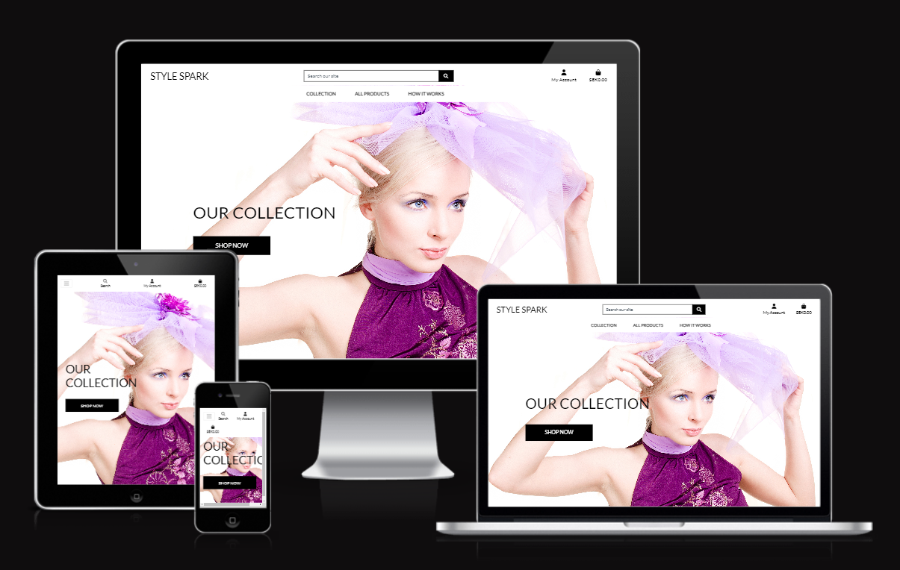

# StyleSpark

## Code Institute - E-Commerce Applications Portfolio Project.

Find your perfect look for any occasion with StyleSpark party dress rental service. Choose from a wide range of stylish, high-quality dresses for all your events, and rent your favorite at a fraction of the retail price.

## Table of Contents

- [Project Structure](#project-structure)
- [Demo](#demo)
- [UX](#ux)
- [User Stories](#user-stories)
- [Strategy](#strategy)
- [Scope](#scope)
- [Structure](#structure)
- [Technologies](#technologies)
- [Features](#features)
- [Testing](#testing)
- [Deployment](#deployment)
- [Credits](#credits)

## Project Structure

## Demo

### Live Demo

A live demo of the website can be found [here](https://project5-stylespark-367466e38579.herokuapp.com/).

## UX

StyleSpark reimagines fashion by offering a curated selection of stunning dresses for rent. Look and feel your best for every occasion, all while embracing sustainable practices and keeping your budget happy.

Here's what makes the StyleSpark experience exceptional:

- Effortless Browsing:
  - A clean and intuitive interface lets you effortlessly browse our curated collection.
  - Filter by occasion to find your perfect match.
  - High-quality photos and detailed descriptions help you visualize the look.
- Seamless Rental Process:
  - Book your desired dress with just a few clicks.
  - Secure payment options ensure a smooth and worry-free transaction.
  - Clear instructions guide you through the rental process.
- Convenient Delivery & Returns:
  - Enjoy hassle-free delivery right to your doorstep.
  - Pre-paid return labels make sending the dress back a breeze.
- Premium Quality & Care:
  - Every dress is meticulously inspected, cleaned, and maintained to ensure pristine condition.
  - We provide detailed care instructions so you can look your best without worry.
  - Should any issue arise with the dress upon arrival, our responsive customer service is here to assist you.
- Sustainable Style:
  - Embrace fashion with a conscience.
  - Renting reduces fashion waste and promotes environmental responsibility.
  - Join the StyleSpark community and make a positive impact alongside looking fabulous.
- Affordable Luxury:
  - Access designer-worthy looks at a fraction of the cost of buying.
  - Refresh your wardrobe for every occasion without breaking the bank.
  - Experience the joy of high fashion without the hefty price tag.
- StyleSpark empowers you to:
  - Look and feel your absolute best for any event.
  - Experiment with different styles and discover your unique fashion voice.
  - Embrace sustainable practices and contribute to a greener future.

Get started with StyleSpark today and redefine the way you experience fashion!

## User Stories

As the developer, I aimed to secure this travel blog, empowering users to create profiles, share adventures through posts with photos, and interact with each other's content. For deeper exploration, users can search and discover new destinations based on keywords, locations, or trending topics, while admins manage users and curate featured content.

### Strategy

This travel blog serves as a gateway to discover Sri Lanka's hidden beauty through user-generated travel stories and photos. Users can explore new destinations and budget-friendly adventures through search, trending topics, and curated content by admins. The blog leverages SEO and collaborations to reach new explorers and potential travelers.

### Scope

The travel blog focuses on user-generated content, allowing users to create profiles, share stories and photos in blog posts, and interact with each other's content. Search and discovery functionalities help users explore destinations based on keywords, locations, or trends, while admins manage users and curate featured content on the homepage.

### Structure

The website follows a traditional web structure with a persistent top navigation bar allowing access to different sections. It includes sections for Home, Blog, City Guide, Food, Travel Tips, Contact Us, Search, Sign In, Sign Up, and Logout, facilitating easy navigation and user engagement.

### Technologies

- HTML
- CSS
- Django Python
- Heroku
- Balsamiq

### Features

#### Existing Features

- Navigation Bar: Provides easy access to different sections of the site, including Home, Products, Cart, Checkout, Profiles, and other relevant pages.
- Home: Introduces users to StyleSpark's party dress rental service, showcasing its offerings and inviting users to explore further.
- Cart: Allows users to manage their selected items before checkout, providing a summary and options for modification.
- Checkout: Guides users through the payment process for renting dresses, ensuring a seamless transaction experience.
- Products: Displays a range of stylish dresses available for rent, categorized and detailed to assist users in making selections.
  - Categorization:
    - Categories: Dresses are categorized based on types such as cocktail dresses, new arrivals, etc., facilitating easy browsing according to user preferences.
    - Tags: Products may be tagged with attributes like color, size, material, occasion (e.g., wedding, party), helping users refine searches and find specific items quickly.
- Search: Enables users to find specific blog posts or products by entering keywords, enhancing usability and navigation efficiency.
- Sign Up, Sign In, Logout: Provides essential user authentication functionalities, allowing new users to register, existing users to log in securely, and all users to log out when necessary.
- Admin Functionality: Empowers administrators to manage user accounts, oversee product listings, and monitor site activity effectively.
- Sorting: Enables users to arrange products or search results based on relevant criteria such as price, popularity, or category.
- Filtering: Allows users to narrow down product listings or search results based on specific attributes or preferences.
- Responsive Design: Ensures optimal viewing and interaction experience across a wide range of devices, enhancing accessibility and usability.

#### Features Left to Implement

- Edit Profile Page: Allow users to edit their profiles.
- Add more images: Enable users to see the different views of the dress.

## Testing

1) Responsive Design Testing:
    - Chrome DevTools:
      - Open your website in Chrome.
      - Right-click and select "Inspect" or press Ctrl+Shift+I.
      - Click the "Toggle device toolbar" button (or press Ctrl+Shift+M).
      - Select various devices from the dropdown list or enter custom dimensions.
      - Ensure the layout adjusts correctly for all screen sizes.
    - Manual Testing:
      - Manually test your application on different physical devices if available, like the Samsung Galaxy S23 Ultra.
2) Cross-Browser Testing:
    - Chrome:
      Open the website and check all functionalities.
    - Firefox:
      Repeat the same steps as in Chrome.
      Check if there are any specific issues related to Firefox.
    - Brave:
      Follow the same process to ensure Brave compatibility.
    - Edge:
      Follow the same process to ensure Edge compatibility.
3) Functional Testing:
    - Forms:
      - Ensure all form fields accept input as expected.
      - Test form validation (both client-side and server-side).
      - Verify successful form submissions and error handling
4) User Management:
      - User Registration:
        - Test user sign-up processes, including email verification if applicable.
      - User Login:
        - Verify login functionality with correct and incorrect credentials.
      - Password Management:
        - Test password reset and change features.
      - Role-Based Access Control:
        - Ensure users have appropriate access based on their roles.
5) Content Creation Features:
      - Content Addition:
        - Test adding new content as different user roles.
      - Content Editing:
        - Verify that content can be edited and changes are reflected appropriately.
      - Content Deletion:
        - Ensure that content deletion works and is irreversible if intended.
6) Additional Testing:
    - Performance Testing:
      - Use tools like Lighthouse to check performance, accessibility, and SEO.
    - Security Testing:
      - Conduct basic security testing to check for vulnerabilities like SQL injection.

## Deployment

This project was deployed using Heroku. Clone the repository, create a new Heroku app, link it to GitHub, and click Deploy.

## Credits

### Content

- Main code was taken from the Code Institute's [Boutique_ado_v1](https://github.com/Code-Institute-Solutions/boutique_ado_v1/tree/master) project.
- Stack Overflow for error handling tips.
- Bootstrap for layout and navigation components.

### Media

- Images from Zalendo.se, Pixabay and Pexels.

### Acknowledgements

- Code Institute Building an E-Commerce Platform
- Code Institute Tutor Support Team.
- Mentor: Medale Oluwafemi.
- Grammar and spelling corrections using quillbot.com.
